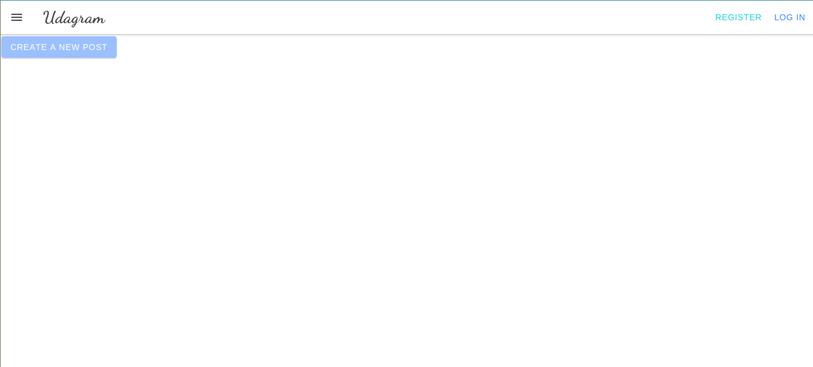
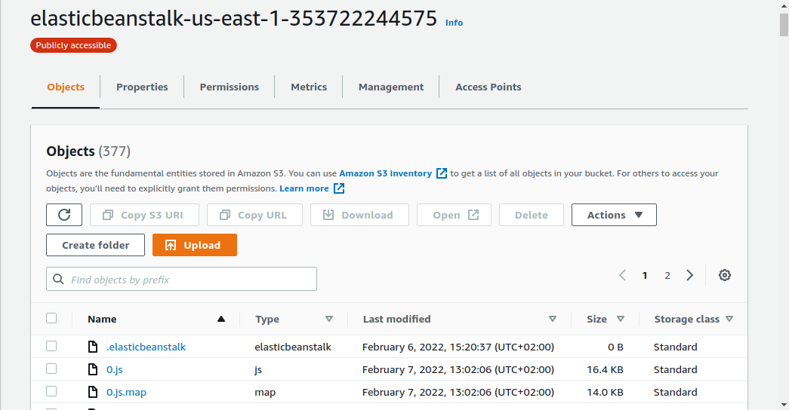
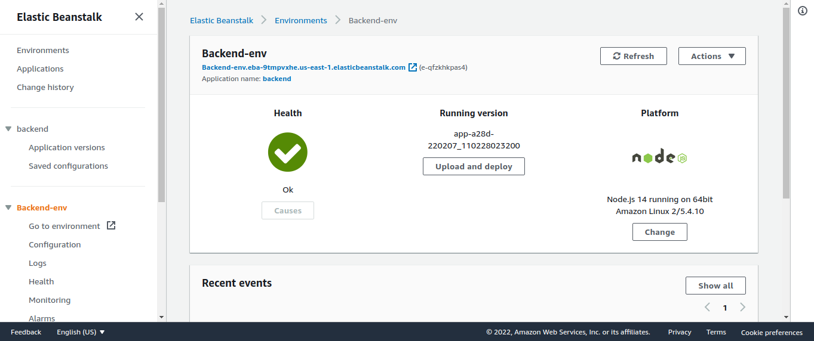
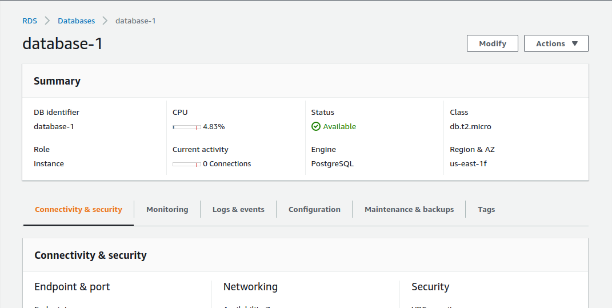
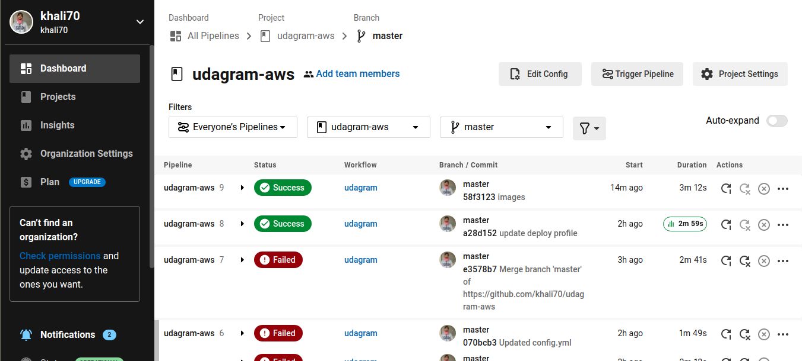

# Udagram

Pipeline Status (master Branch): [](https://circleci.com/gh/khali70/udagram-aws/?branch=master)

This is a social media app like facebook instagram...etc

## Live Preview

[](http://elasticbeanstalk-us-east-1-353722244575.s3-website-us-east-1.amazonaws.com/)<br>

## Overview

### S3 Bucket

[]()<br>

### Elastic Beanstalk

[]())<br>

### RDS

[]()<br>

### Last success Circle CI build

[]()<br>

### Infrastructure

1. S3 Bucket that hosts the frontend which is built using Angular framework.
2. S3 Bucket that hosts the media files.
3. Elastic Beanstalk that hosts the backend which is built using Node.js and Express.js in typescript.
4. RDS that hosts the postgres DB which is built using postgres.
   []()<br>

### Pipeline Overview

1. CircleCi is triggered to start the build.
2. Checkout the code from the repository.
3. Install node.js,npm
4. install Google chrome for testing
5. Install AWS & Elastic Beanstalk CLI.
6. Configure AWS Credentials.
7. Run frontend tests.
8. Build and Deploy frontend to S3.
9. Build and Deploy backend to Elastic Beanstalk.

## Required Tools

```
- Node v14.15.1 (LTS) or more recent. It is always advisable to keep node to latest LTS version.

- npm 6.14.8 (LTS) or more recent, Yarn can also work.

- [AWS CLI](https://docs.aws.amazon.com/cli/latest/userguide/cli-chap-install.html)

- [Elastic Beanstalk CLI](https://github.com/aws/aws-elastic-beanstalk-cli-setup).

- A RDS database running Postgres.

- An S3 bucket.

- An Elastic Beanstalk environment.

```

## Installations

## In your local machine

inside the udagram/udagram-api add in `.env` file

```
POSTGRES_USERNAME=<your_db_user>
POSTGRES_PASSWORD=<your_db_password>
POSTGRES_DB=<your_db_name>
POSTGRES_PORT=<your_db_port>
POSTGRES_HOST=<your_db_host>
PORT=<your_preferred_server_port>
JWT_SECRET=<your_jwt_secret>
AWS_BUCKET=<your_aws_bucket_name>
AWS_REGION=<your_aws_region>
```

## Built With

- [Angular](https://angular.io/) - Single Page Application Framework
- [Node](https://nodejs.org) - Javascript Runtime
- [Express](https://expressjs.com/) - Javascript API Framework
