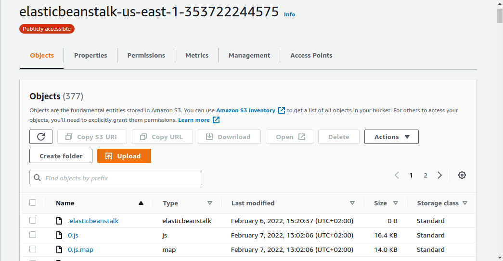

# Infrastructure

The web is hosted on AWS using simple infrastructure to hosting the UI on S3, The API on elastic beanstalk, and the database on RDS.

<p align="center">

</p>

# AWS Configuration

## RDS


## Elastic Beanstalk


## S3



#### Steps

1. Create Bucket first through this [link](https://s3.console.aws.amazon.com/s3/home)
2. Add this rule `Bucket policy`

```json
{
  "Version": "2012-10-17",
  "Statement": [
    {
      "Sid": "PublicReadGetObject",
      "Effect": "Allow",
      "Principal": "*",
      "Action": "s3:GetObject",
      "Resource": "arn:aws:s3:::<BUCKET_NAME>/*"
    }
  ]
}
```

3. Configure [IAM](https://console.aws.amazon.com/iamv2/home?#/home) - Identity and Access Management (IAM)

   - Select `Users` -> Click `Add user`
   - Under `Select AWS access type` section mark `Access key - Programmatic access`
   - Click `Next: Permissions`
   - Under `Set permissions` section select user `Group` the user that has `AdministratorAccess` policies.
   - If the user not exist click on `Create Group` and add name with `AdministratorAccess` police.
   - Then click on `Next: Tags` -> Skip tags as it is options -> Then click on `Next: Review`
   - Finally click on `Create user`

4. Deploy script

```bash
# Replace BUCKET_NAME with your bucket name
aws s3 cp --recursive ./www s3://<BUCKET_NAME>/
```

5.  Configure CircleCI
    First go to Project Page -> Project Settings -> Environment Variables then Add those variables

        - AWS_ACCESS_KEY_ID
        - AWS_SECRET_ACCESS_KEY
        - AWS_DEFAULT_REGION
